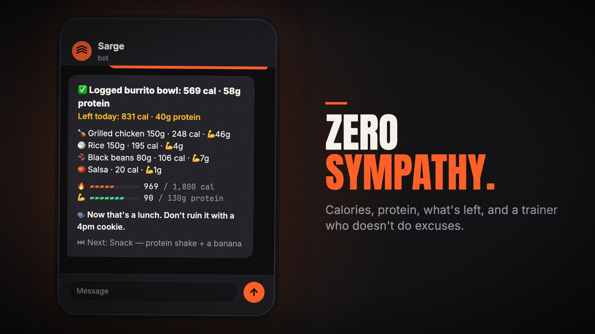
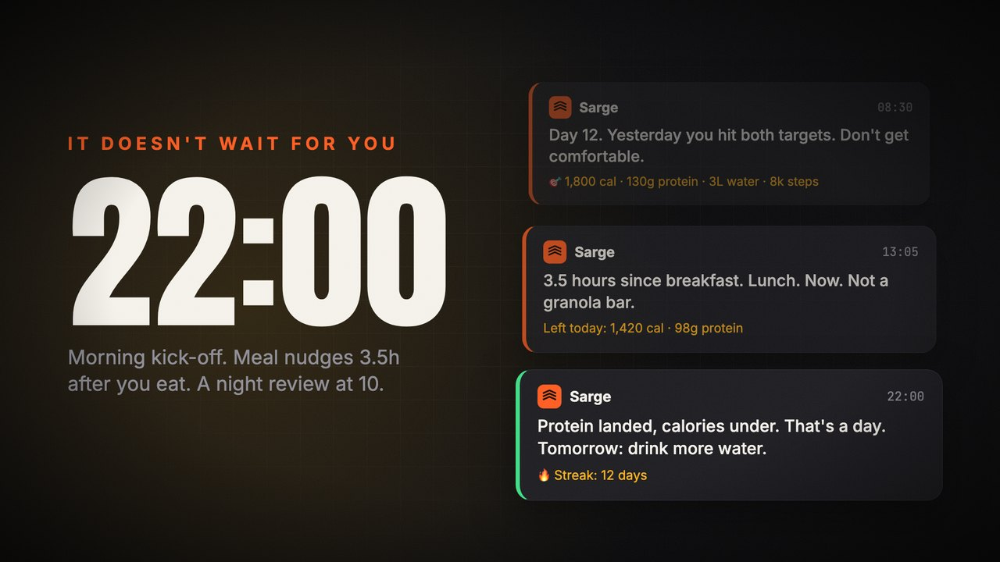
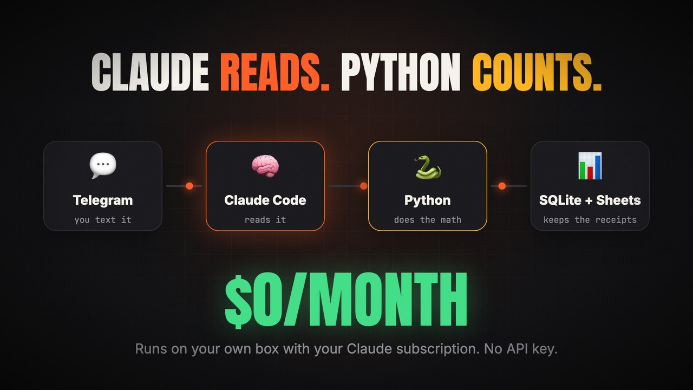
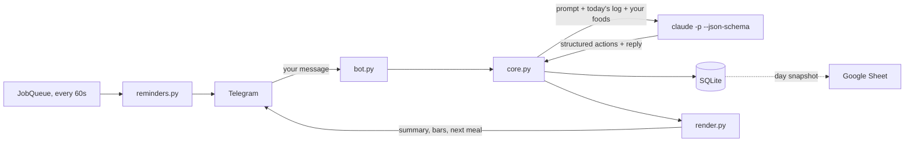

<p align="center">
  
</p>

<p align="center">
  
  
  
  
  
</p>

<p align="center">
  <b>You text it what you ate, in plain English.</b> It works out the calories and protein, tells you what's left for the day, and nags you when you skip meals.<br>
  Claude reads your messages. Python does all the math. No sympathy included.
</p>

<p align="center">
  <a href="docs/demo.mp4"></a><br>
  <sub>▶ <a href="docs/demo.mp4"><b>Watch the 26-second demo</b></a> (sound on 🔊)</sub>
</p>

<table>
  <tr>
    <td width="33%"></td>
    <td width="33%"></td>
    <td width="33%"></td>
  </tr>
  <tr>
    <td align="center"><b>🍗 Log in plain English</b><br><sub>Exact calories and protein, plus what's left</sub></td>
    <td align="center"><b>⏰ It doesn't wait for you</b><br><sub>Morning kick-off, meal nudges, a night review</sub></td>
    <td align="center"><b>🧠 Claude reads, 🐍 Python counts</b><br><sub>Self-hosted on your Claude subscription</sub></td>
  </tr>
</table>

## 💬 What a reply looks like

```
you    › chicken burrito bowl, 150g chicken, 150g rice, black beans, salsa

sarge  › ✅ Logged burrito bowl: 569 cal · 58g protein
         Left today: 831 cal · 40g protein

         🍗 Grilled chicken 150g · 248 cal · 💪46g
         🍚 Rice 150g · 195 cal · 💪4g
         🫘 Black beans 80g · 106 cal · 💪7g
         🍅 Salsa · 20 cal · 💪1g

         🔥 ▰▰▰▰▰▱▱▱▱▱ 969 / 1,800 cal
         💪 ▰▰▰▰▰▰▰▱▱▱ 90 / 130g protein

         🗣 Now that's a lunch. Don't ruin it with a 4pm cookie.

         ⏭ Next: Snack — protein shake + a banana
```

## ✨ What it does

- **Logs food from plain English.** "Chicken rice bowl, 150g chicken, 5g oil", "a handful of almonds", "that rice was 200g actually". Mixed dishes get split into their parts, and fixes edit the right item.
- **Remembers your foods.** Give it a label once ("Chobani 0% Greek yogurt, 170g: 90 cal, 16g protein…") and it uses those exact numbers from then on.
- **Only tells you what matters.** Every meal reply starts with one summary line: calories and protein logged, and what's left today. Chat that isn't food gets a short answer with no stats.
- **Stays on your case:**
  - A morning message at 8:30 with yesterday's result and your streak
  - A "go eat" reminder 3.5 hours after your last real meal. Black coffee or a few bites don't reset the timer.
  - A 1pm nag if you haven't logged anything yet
  - A night review at 10pm
- **Tracks water, steps and vitamin D** too: "1L water", "9200 steps", "took vit D".
- **Can copy your log to a Google Sheet**: a Daily tab with one row per day, and a Log tab with every item.
- **Costs nothing to run.** The "brain" is [Claude Code](https://docs.anthropic.com/en/docs/claude-code) in headless mode, signed in with your existing Claude subscription. No API key, no paid servers. It runs on any always-on machine: a home server, a Raspberry Pi 5, an old laptop.

## ⚙️ How it works



The work is split so the numbers are always right:

- **Claude interprets.** It turns your text into structured actions: food items with macros, edits, deletions, water, steps, and foods to remember. It also writes the one-line trainer comment. The reply is checked against a JSON schema, and every item id is validated before it's applied.
- **Python enforces.** It stores everything, adds up the totals, draws the progress bars, and runs the timers. Claude never states totals, so it can't get them wrong.

A "day" ends at 4am, so a midnight snack counts toward the day you ate it.

## 🚀 Setup

What you need:

- An always-on **Linux** machine. macOS works for trying it out.
- **Python 3.11+**
- A **Claude subscription** (Pro or Max) for Claude Code
- A **Telegram** account

### 1. Create the Telegram bot

1. In Telegram, message [@BotFather](https://t.me/BotFather) and send `/newbot`. Pick a name and a username.
2. Copy the **token** it gives you. It looks like `123456789:AA...`.
3. Message [@userinfobot](https://t.me/userinfobot) to get your numeric **user id**. Sarge only answers this id.

### 2. Install and sign in to Claude Code on the machine

```bash
curl -fsSL https://claude.ai/install.sh | bash   # or: npm install -g @anthropic-ai/claude-code
claude                                           # run once and sign in with your Claude account, then /exit
which claude                                     # note this absolute path, e.g. /home/you/.local/bin/claude
```

Check that headless mode works:

```bash
claude -p "say hi" --output-format json
```

### 3. Get the code

```bash
git clone https://github.com/Ishan-sa/sarge.git ~/sarge
cd ~/sarge
python3 -m venv .venv
.venv/bin/pip install -r requirements.txt
```

### 4. Configure

```bash
cp .env.example .env
chmod 600 .env
nano .env
```

Set at least these:

| Variable | What to put |
|---|---|
| `TELEGRAM_TOKEN` | The token from BotFather |
| `CLAUDE_BIN` | The absolute path from `which claude` |
| `OWNER_ID` | Your Telegram user id. If you leave it empty, the first person to send `/start` owns the bot. |
| `SARGE_USER_NAME` | Your name, as Sarge should use it |

These are optional: `CLAUDE_MODEL` (default `sonnet`), `SARGE_TZ` (default `America/Vancouver`), and `TARGET_KCAL`, `TARGET_PROTEIN`, `TARGET_WATER_ML`, `TARGET_STEPS`.

**Put in your own diet plan.** `sarge/plan.py` holds an example plan. `PLAN_TEXT` is the plan in words, which Claude reads. `SLOTS` lists the meals Sarge tracks and suggests next. You can edit that file directly, or copy it to `sarge/plan_local.py`, which is gitignored and used instead, so your plan stays private and `git pull` never conflicts.

### 5. Try it

```bash
.venv/bin/python -m sarge.bot
```

Send your bot `/start`, then something like `greek yogurt with berries and granola`. Stop it with `Ctrl+C` when you're done.

### 6. Keep it running (systemd)

```bash
mkdir -p ~/.config/systemd/user
cp deploy/sarge.service ~/.config/systemd/user/
systemctl --user daemon-reload
systemctl --user enable --now sarge
sudo loginctl enable-linger "$USER"      # keep running after you log out and after reboots

journalctl --user -u sarge -f            # live logs
```

The unit file assumes the code lives in `~/sarge`. If you put it somewhere else, change `WorkingDirectory` and `ExecStart`.

### 7. Optional: mirror to a Google Sheet

1. Create a new Google Sheet, then open **Extensions → Apps Script**.
2. Paste in the contents of [`deploy/sheet.gs`](deploy/sheet.gs).
3. Replace `__SHEET_SECRET__` with a long random string. `openssl rand -hex 24` makes one.
4. Click **Deploy → New deployment → Web app**. Set *Execute as: Me* and *Who has access: Anyone*, then authorize it.
5. Copy the web app URL, the one that ends in `/exec`. Add it and your secret to `.env`:
   ```
   SHEET_WEBHOOK_URL=https://script.google.com/macros/s/.../exec
   SHEET_SECRET=the-same-random-string
   ```
6. Run `systemctl --user restart sarge`. The **Daily** and **Log** tabs appear the first time you log something.

The sync sends a full copy of the day every time, so a failed push is fixed by the next one. If the sheet is down, logging still works.

## 🗣 Using it

| You send | Sarge does |
|---|---|
| `salmon, 200g potatoes, broccoli, 5g olive oil` | Logs the meal and replies with what's left today |
| `that rice was 200g` / `remove the sauce` / `delete that` | Edits or deletes today's items |
| `Chobani 0% Greek yogurt 170g: 90 cal, 16g protein, 6g carbs, 0g fat` | Saves the label values for next time |
| `1L water` · `9200 steps` · `took vit D` | Tracks the extras |
| `what's left?` / `what should I eat?` | Shows the numbers and suggests your next meal |
| `/today` | Everything logged today |
| `/week` | A table of the last 7 days |
| `/undo` | Deletes the last entry |
| `/foods` | The foods it remembers |

### ⏰ Schedule

All times are in `SARGE_TZ`. You can change them in `sarge/config.py`.

| When | Message |
|---|---|
| 08:30 | Morning message: diet day number, how yesterday went, your streak |
| 3.5 h after your last meal (08:00–21:30) | A reminder to eat. Only sent if protein or planned meals are still missing. |
| 13:00, if nothing is logged | A nag |
| 22:00 | Night review: what went well, where you slipped, one thing to fix tomorrow |

Claude writes each reminder in the trainer voice, and Python adds the exact numbers below it. If Claude fails, a built-in template is sent instead, so reminders always go out. Reminders survive restarts, and a missed night review is sent when the bot comes back up.

## 🧪 Development

```bash
.venv/bin/pip install pytest
.venv/bin/python -m pytest -q
```

The tests use a fake brain and never call Claude.

The demo video's source is in [`demo/`](demo). It's made with Remotion, with a soundtrack synthesized in numpy.

```
sarge/
  bot.py        Telegram handlers, owner check, 60 s reminder tick
  brain.py      Claude Code headless calls, JSON schema, prompts and voice
  core.py       applies Claude's actions to the store (validated, today only)
  store.py      SQLite: entries, items, extras, saved foods, messages, state
  render.py     every message layout (HTML): summary line, bars, next meal
  reminders.py  decides which reminder is due and what it says
  sheets.py     Google Sheet mirror client
  plan.py       example diet plan (override in plan_local.py)
  config.py     targets, schedule, env loading
deploy/
  sarge.service systemd user unit
  sheet.gs      Apps Script web app for the sheet mirror
```

## 🩺 Troubleshooting

- **The bot doesn't answer.** Run `journalctl --user -u sarge -f`. A line like `ignoring update from user X (owner is Y)` means `OWNER_ID` is wrong.
- **"⚠️ Brain failed".** Run `$CLAUDE_BIN -p hi` as the same user the service runs as. You may need to sign in again. Each call times out after 90 s.
- **`claude: command not found` over SSH.** Non-login shells often don't have `~/.local/bin` on `PATH`. That's why `CLAUDE_BIN` is an absolute path.
- **The sheet doesn't update.** Look for `sheet sync failed` in the logs. After you edit `sheet.gs`, deploy a new version: Deploy → Manage deployments → Edit → New version.

## 🔒 Privacy

Everything stays on your machine (SQLite in `data/`), except:
- your messages, which go to Claude through your own Claude Code login
- your log, which goes to your own Google Sheet, if you turn that on

`.env` and `data/` are gitignored.

## 📄 License

[MIT](LICENSE)
